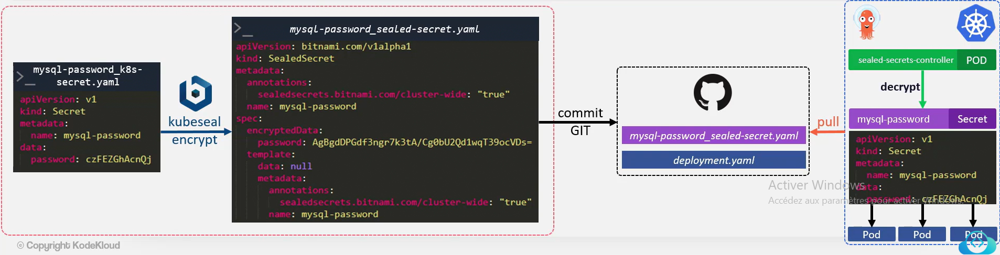

# argocd app create 

# argocd app list

# kubectl -n argocd describe pod argocd-repo-server | grep -i "ARGO_RECONCILIATION_TIMEOUT:" -B1
#You can use the -A or -B to dislay number of lines that either precede or come after the search string. The -A flag denotes the lines #that come after the search string and -B prints the output that appears before the search string. For example

# kubectl -n argocd patch configmap argocd-cm --patch='{"data":{"timeout.reconciliation":"300s"}}'

argocd app set --sync-policy=auto health-check-app

argocd app get health-check-app

argocd app set health-check-app --sync-policy=auto --self-heal

argocd app set health-check-app  --sync-policy=auto --self-heal --auto-prune

# User management:
 argocd account list
# Add new account:
argocd -n argocd patch configmap argocd-cm --patch='{"data":{"accounts.jai": "apiKey,login"}}'
argocd -n argocd patch configmap argocd-cm --patch='{"data":{"accounts.ali": "apiKey,login"}}'
# Update Password of users
argocd account update-password --account jai
# Update role of user
kubectl -n argocd patch configmap argocd-rbac-cm --patch='{"data":{"policy.default": "role:readonly"}}'

kubectl -n argocd patch configmap argocd-rbac-cm --patch='{"data":{"policy.csv":"p, role:create-app, applications, create, *, allow\ng, alice, role:create-app"}}'

kubectl -n argocd get configmap argocd-rbac-cm -o yaml
# Login on CLI
argocd login $(kubectl get service argocd-server -n argocd --output=jsonpath='{.spec.clusterIP}') --username admin --password admin123 --insecure
argocd app sync demo-app

# Check permission
argocd account can-i delete applications "*"

# Bitnami Sealed Secret with ArgoCD
- Create a secret

kubectl create secret generic mysql-password --from-literal=password=s1Ddh@rt# --dry-run=client -o yaml > mysql-password_k8s-secret.yaml

- Install the controller

argocd app create sealed-secrets --repo https://bitnami-labs.github.io/sealed-secrets --helm-chart sealed-secrets --revision 2.2.0 --dest-namespace kubesystem --dest-server https://1.2.3.4

- Install the client of the controller

wget https://github.com/bitnami-labs/sealed-secrets/releases/download/v0.18.0/kubeseal-0.18.0-linux-amd64.tar.gz -O kubeseal && sudo install -m 755 kubeseal /usr/local/bin/kubeseal

- Create and encrypt the secret with kubeseal

kubeseal -o yaml --scope cluster-wide --cert sealedSecret.crt < mysql-password_k8s-secret.yaml > mysql-password_sealed-secret.yaml

# Hashicorp Vault with Argocd

# Remove new line
cat okta.crt | base64 | tr -d "\n"
kubectl -n kube-system get secret <sealed-secrets-key> -o json | jq -r .data'."tls.crt"' | base64 -d > /root/sealedSecret-publicCert.crt